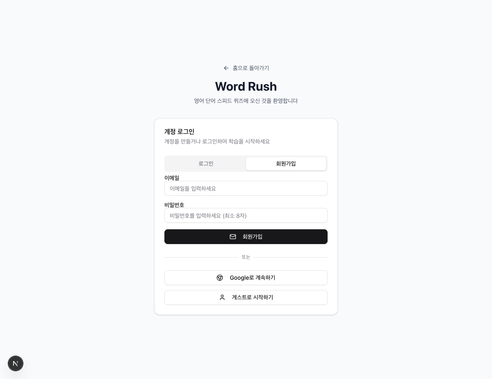
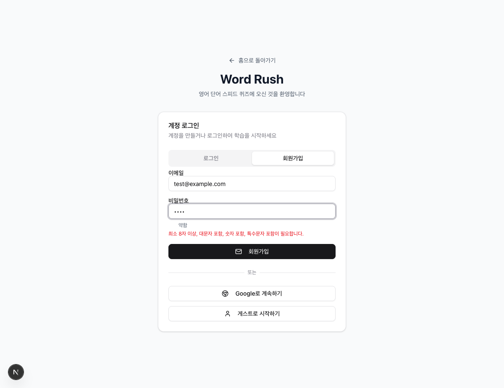
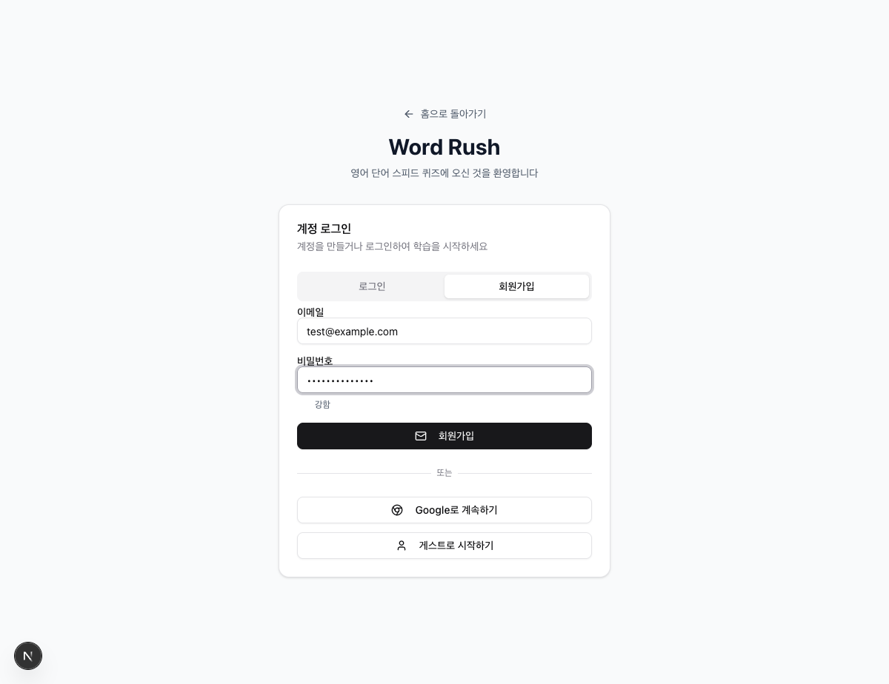
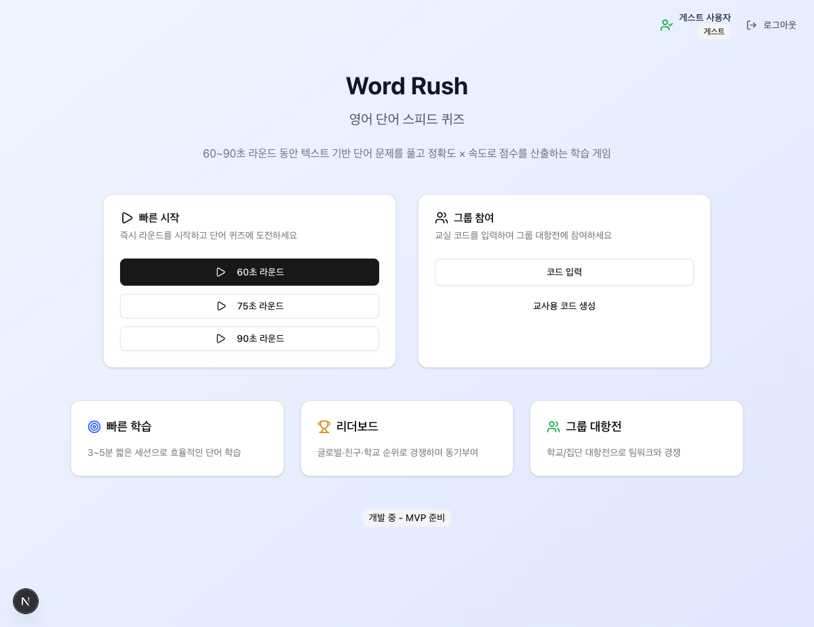

# Authentication 체크포인트

## 소개

- WordRush 프로젝트의 인증 시스템을 Supabase와 연동하여 구현했습니다.
- 사용자 친화적인 UI/UX와 보안을 강화한 로그인/회원가입 기능을 제공합니다.
- 게스트 로그인, 이메일 인증, Google OAuth, 비밀번호 강도 검증 등 다양한 인증 방식을 지원합니다.

## 예상 작업 (Expected Tasks)

- [x] '회원가입(Create Account)' 페이지를 구현한다.
- [x] '로그인(Sign in)' 페이지를 구현한다.
- [x] `action` 함수를 사용해 인증 로직을 구현한다.

## 회원가입 페이지

- **Github 커밋 링크**: [feat: 로그인 페이지 기능 개선 및 비밀번호 강도 검증 추가](https://github.com/lips85/makers-second/commit/990b388be2b9a73c94bb0ac2f907af3c93f8ee47)
- **스크린샷**:
  - 
  - 
  - 
- **설명**:
  - **비밀번호 강도 검증**: 실시간으로 비밀번호의 강도를 5단계로 평가하고 시각적으로 표시합니다.
  - **사용자 친화적 피드백**: 부족한 비밀번호 조건을 구체적으로 안내합니다 (최소 8자, 대소문자, 숫자, 특수문자).
  - **개발 환경 이메일 확인 우회**: 개발 환경에서는 이메일 확인 없이 즉시 로그인 가능합니다.
  - **에러 처리 개선**: 기술적 오류 메시지를 사용자가 이해하기 쉬운 메시지로 변환합니다.

## 로그인 페이지

- **Github 커밋 링크**: [feat: 로그인 페이지 기능 개선 및 비밀번호 강도 검증 추가](https://github.com/lips85/makers-second/commit/990b388be2b9a73c94bb0ac2f907af3c93f8ee47)
- **스크린샷**:
  - 
  - 
- **설명**:
  - **다양한 인증 방식**: 이메일/비밀번호, Google OAuth, 게스트 로그인을 지원합니다.
  - **세밀한 로딩 상태 관리**: 각 인증 방법별로 구체적인 로딩 메시지를 표시합니다.
  - **성공/실패 피드백**: 로그인 성공 시 녹색 알림, 실패 시 빨간색 알림으로 명확한 피드백을 제공합니다.
  - **게스트 로그인**: 회원가입 없이 즉시 서비스를 이용할 수 있는 게스트 모드를 제공합니다.
  - **사용자 친화적 에러 메시지**: "Invalid login credentials" → "이메일 또는 비밀번호가 올바르지 않습니다" 등으로 변환합니다.

## 주요 구현 기능

### 1. 인증 시스템 (AuthContext)

- **Supabase 연동**: Supabase Auth를 사용한 안전한 인증 처리
- **세션 관리**: 자동 토큰 갱신 및 세션 상태 관리
- **게스트 사용자 지원**: 임시 사용자 생성 및 데이터 이전 기능

### 2. 비밀번호 보안

- **실시간 강도 검증**: 5단계 색상 바로 비밀번호 강도 시각화
- **구체적인 피드백**: 부족한 조건을 명확히 안내
- **최소 요구사항**: 8자 이상, 대소문자, 숫자, 특수문자 포함

### 3. 사용자 경험 개선

- **로딩 상태 세분화**: 로그인, 회원가입, Google, 게스트 각각 다른 로딩 메시지
- **성공 메시지**: 로그인/회원가입 성공 시 명확한 피드백
- **에러 처리**: 기술적 오류를 사용자 친화적 메시지로 변환

### 4. 개발 환경 최적화

- **이메일 확인 우회**: 개발 환경에서 즉시 로그인 가능
- **환경별 분기 처리**: 개발/프로덕션 환경에 맞는 동작

## 기술 스택

- **Frontend**: Next.js 15, TypeScript, TailwindCSS, shadcn/ui
- **Backend**: Supabase (PostgreSQL, Auth, Realtime)
- **인증**: Supabase Auth, Google OAuth
- **상태 관리**: React Context API

## 보안 고려사항

- **RLS (Row Level Security)**: Supabase에서 데이터베이스 레벨 보안 적용
- **비밀번호 강도 검증**: 사용자 계정 보안 강화
- **에러 메시지**: 민감한 정보 노출 방지
- **세션 관리**: 안전한 토큰 처리 및 자동 갱신

## 향후 개선 계획

- **2FA (2단계 인증)**: 보안 강화를 위한 추가 인증 단계
- **소셜 로그인 확장**: GitHub, Apple 등 다른 제공자 추가
- **비밀번호 재설정**: 이메일을 통한 비밀번호 재설정 기능
- **계정 관리**: 프로필 수정, 계정 삭제 등 사용자 관리 기능
