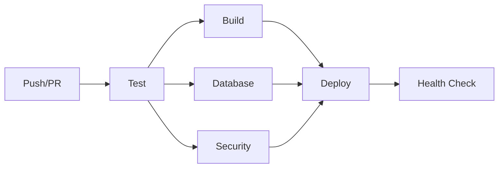

# 🚀 CI/CD 파이프라인 가이드

WordRush 프로젝트의 CI/CD 파이프라인 구성과 운영 방법을 설명합니다.

## 📋 목차

1. [CI/CD 파이프라인 개요](#cicd-파이프라인-개요)
2. [워크플로우 구성](#워크플로우-구성)
3. [스키마 검증 시스템](#스키마-검증-시스템)
4. [배포 프로세스](#배포-프로세스)
5. [모니터링 및 알림](#모니터링-및-알림)
6. [트러블슈팅](#트러블슈팅)

## 🎯 CI/CD 파이프라인 개요

현재 프로젝트는 **GitHub Actions**를 기반으로 하는 CI/CD 파이프라인을 사용합니다.



### 주요 특징
- ✅ **자동화된 테스트** (Unit, Integration, UI, E2E)
- ✅ **스키마 동기화 검증** (로컬 ↔ Supabase)
- ✅ **보안 검사** (npm audit, 취약점 스캔)
- ✅ **배포 후 헬스체크** (프로덕션 모니터링)
- ✅ **실패 시 자동 알림** (Slack 연동)

## 🔧 워크플로우 구성

### 1. Test Workflow (`.github/workflows/test.yml`)

**트리거:** `push` 또는 `pull_request` to `main`, `develop`

```yaml
jobs:
  test:        # 코드 품질 검증
  build:       # 빌드 테스트
  database:    # 스키마 검증 ← 새로 추가!
  security:    # 보안 검사
```

#### 🔍 Database Job 세부 내용
```bash
# 1. 스키마 동기화 상태 확인
npm run db:compare

# 2. 데이터베이스 검증
npm run db:check

# 3. 실패 시 가이드 제공
echo "1. npm run db:compare"
echo "2. supabase db push"
echo "3. npm run db:sync-check"
```

### 2. Deploy Workflow (`.github/workflows/deploy.yml`)

**트리거:** `push` to `main` 또는 수동 실행

```yaml
jobs:
  pre-deployment-checks:   # 배포 전 검증
  deploy-vercel:          # Vercel 배포
  post-deployment-checks: # 배포 후 검증
  notify:                 # 결과 알림
```

## 🗃️ 스키마 검증 시스템

### 스키마 비교 스크립트 (`scripts/compare-schemas.ts`)

로컬 스키마와 Supabase 프로덕션 DB를 실시간으로 비교합니다.

```typescript
// 사용법
npm run db:compare        # 스키마 비교만
npm run db:sync-check     # 비교 + 검증
```

#### 검증 항목
- **테이블 목록 일치성**
- **컬럼 구조 동일성**
- **데이터 타입 호환성**
- **제약 조건 확인**

#### 결과 해석
```bash
✅ 스키마 동기화 상태: 정상        # 배포 가능
❌ 스키마 동기화 상태: 불일치      # 마이그레이션 필요
```

### Supabase RPC 함수

안전한 스키마 정보 조회를 위한 함수들:

```sql
-- 전체 스키마 정보
SELECT * FROM get_schema_info();

-- 테이블 목록만
SELECT * FROM get_table_list();
```

## 🚢 배포 프로세스

### 1. 개발 → 프로덕션 플로우

```bash
# 1. 개발 완료 후 main 브랜치에 머지
git checkout main
git merge feature-branch

# 2. 자동 배포 트리거
git push origin main

# 3. CI/CD 파이프라인 실행
# - 스키마 검증
# - 테스트 실행  
# - 보안 검사
# - Vercel 배포
# - 헬스체크
```

### 2. 수동 배포

```bash
# GitHub Actions에서 수동 실행
# Repository → Actions → Deploy to Production → Run workflow
```

### 3. 배포 실패 시 대응

```bash
# 스키마 불일치로 인한 실패
npm run db:compare              # 차이점 확인
supabase db push               # 마이그레이션 적용
npm run db:sync-check          # 재검증

# 테스트 실패로 인한 실패
npm test                       # 로컬에서 테스트 확인
npm run test:coverage          # 커버리지 확인

# 보안 취약점으로 인한 실패
npm audit fix                  # 자동 수정 시도
npm audit                      # 수동 확인 필요한 항목 검토
```

## 📊 모니터링 및 알림

### 1. Health Check API

프로덕션 환경의 실시간 상태 모니터링:

```bash
# 엔드포인트
GET /api/health

# 응답 예시
{
  "status": "healthy",
  "timestamp": "2024-01-19T10:30:00Z",
  "responseTime": 150,
  "checks": {
    "env": true,
    "database": true,
    "api": true,
    "tables": 9
  }
}
```

### 2. Slack 알림 (선택사항)

배포 결과를 Slack으로 자동 알림:

```yaml
# GitHub Secrets에 설정 필요
SLACK_WEBHOOK_URL: "https://hooks.slack.com/..."
```

### 3. 모니터링 대시보드

- **Vercel Dashboard**: 배포 상태, 성능 메트릭
- **Supabase Dashboard**: DB 성능, 쿼리 분석
- **GitHub Actions**: 빌드 히스토리, 실패 로그

## 🛠️ 트러블슈팅

### 자주 발생하는 문제들

#### 1. 스키마 동기화 실패
```bash
❌ Error: Missing table: attendance_logs

# 해결방법
supabase migration new create_attendance_logs
# SQL 파일 작성 후
supabase db push
```

#### 2. 환경변수 누락
```bash
❌ Error: Missing required environment variables

# GitHub Secrets 확인 필요
- NEXT_PUBLIC_SUPABASE_URL
- NEXT_PUBLIC_SUPABASE_ANON_KEY  
- SUPABASE_SERVICE_ROLE_KEY
```

#### 3. 테스트 타임아웃
```bash
❌ Tests timed out

# Jest 설정 조정
"testTimeout": 30000
```

#### 4. 배포 후 404 에러
```bash
# Vercel 라우팅 설정 확인
# next.config.ts의 rewrites 규칙 검토
```

### 디버깅 명령어

```bash
# 로컬 환경에서 CI/CD 시뮬레이션
npm run type-check          # TypeScript 검사
npm run lint               # ESLint 검사  
npm run test:coverage      # 테스트 + 커버리지
npm run db:sync-check      # 스키마 검증
npm run build              # 빌드 검증

# Supabase 관련 디버깅
supabase status            # 로컬 서비스 상태
supabase db diff           # 스키마 차이점
supabase logs              # 서비스 로그
```

## 📈 성능 최적화

### CI/CD 실행 시간 단축

1. **캐싱 활용**
   ```yaml
   - uses: actions/setup-node@v4
     with:
       cache: 'npm'  # npm 캐시 활용
   ```

2. **병렬 실행**
   ```yaml
   # test, build, database, security가 병렬로 실행
   needs: test  # test 완료 후에만 실행
   ```

3. **선택적 실행**
   ```yaml
   # 특정 조건에서만 실행
   if: github.ref == 'refs/heads/main'
   ```

### 배포 성능 개선

- **Vercel Edge Functions** 활용
- **이미지 최적화** (Next.js Image)
- **코드 스플리팅** (Dynamic Imports)
- **CDN 캐싱** (Vercel Edge Network)

## 🔒 보안 고려사항

### Secrets 관리
```bash
# GitHub Repository Settings → Secrets and variables → Actions

# 필수 Secrets
NEXT_PUBLIC_SUPABASE_URL          # Public (노출 가능)
NEXT_PUBLIC_SUPABASE_ANON_KEY     # Public (노출 가능)
SUPABASE_SERVICE_ROLE_KEY         # Private (노출 금지)
SLACK_WEBHOOK_URL                 # Private (선택사항)
PRODUCTION_URL                    # Public (선택사항)
```

### RLS (Row Level Security)
- 모든 public 테이블에 RLS 활성화
- 스키마 조회 함수는 읽기 전용으로 제한
- 민감한 정보 접근 차단

### 보안 검사 항목
- npm audit (의존성 취약점)
- ESLint security rules
- TypeScript strict mode
- 환경변수 누출 방지

---

## 💡 추가 개선 아이디어

### 향후 도입 고려사항

1. **성능 모니터링**
   - Lighthouse CI 연동
   - Web Vitals 추적
   - Bundle Analyzer 자동 실행

2. **고급 테스트**
   - Visual Regression Testing
   - Load Testing (Artillery, k6)
   - Cross-browser Testing

3. **자동화 확장**
   - 자동 의존성 업데이트 (Dependabot)
   - 자동 백업 스케줄링
   - 장애 감지 및 자동 복구

4. **개발 경험 개선**
   - Pre-commit hooks (Husky)
   - 커밋 메시지 검증 (Conventional Commits)
   - 자동 changelog 생성

---

**📞 문의사항이 있으시면 팀 Slack 채널 또는 GitHub Issues를 활용해 주세요!**
